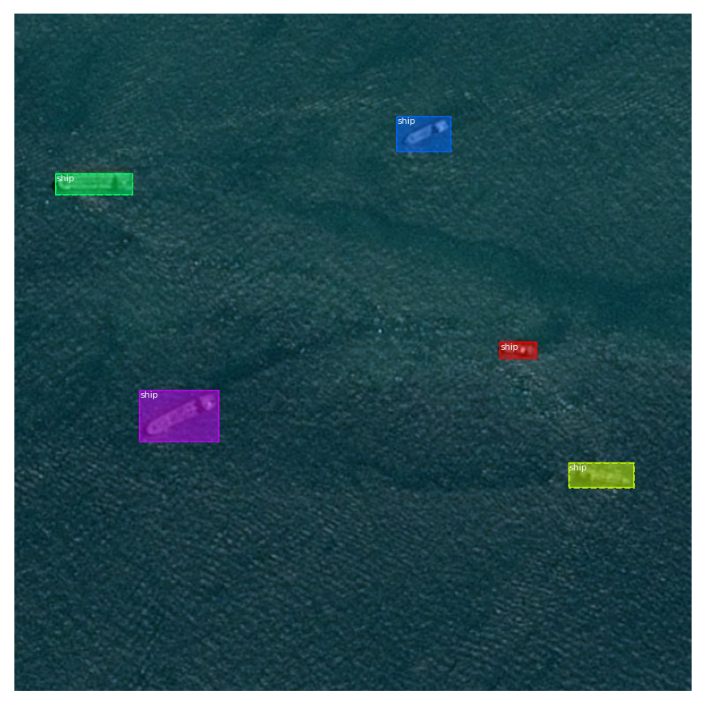

## Kaggle Airbus Ship Detection Challenge

This project is for Kaggle competiton [Airbus Ship Detection Challenge](https://www.kaggle.com/c/airbus-ship-detection).

## File strcture

AirBus                         
    ├─PY                        Create config and train model
    │  └─Train Mask_RCNN.ipynb
    └─assets                    
